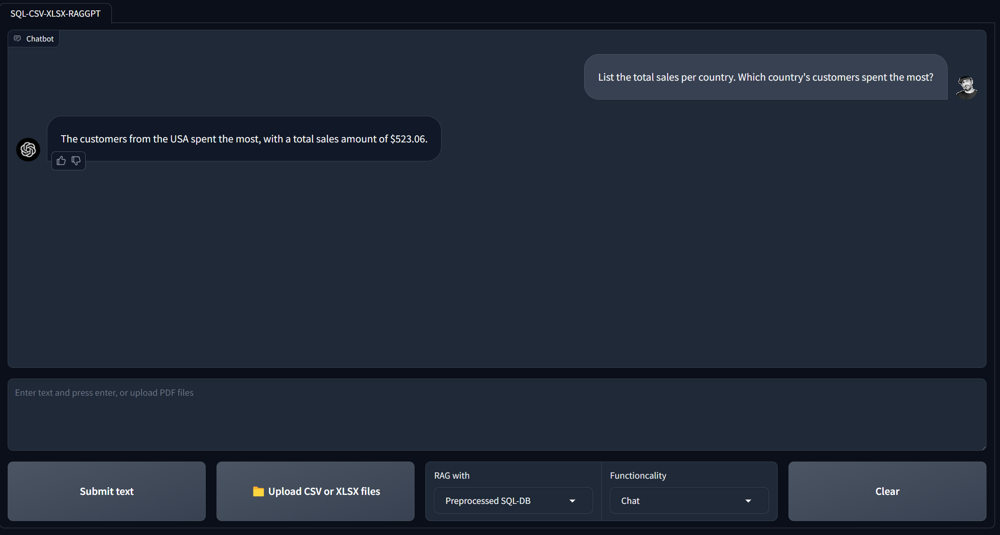

# KnowledgeGraph-Q&A-and-RAG-with-TabularData

`KnowledgeGraph-Q&A-and-RAG-with-TabularData` is a chatbot project that utilizes <u>knowledge graph</u>, <u>GPT 3.5</u>, <u>Langchain graph agent</u>, and <u>Neo4j</u> graph database and allows users to interact (perform <u>Q&A and RAG</u>) with Tabular databases (CSV, XLSX, etc.) using natural language. This project also demonstrates an approach for cunstructing the knowledge graph from unstructured data by leveraging LLMs.

## Features:
- Chat with a graphDB created from tabular data.
- RAG with a graphDB created from tabular data.

**Key NOTE:** Remember to NOT use a Neo4j with WRITE privileges. Use only READ and limit the scope. Otherwise your user can manupulate the data (e.g ask your chain to delete data). So, make sure that your database connection permissions are always scoped as narrowly as possible for your chain/agent’s needs (This warning applies to both designing the chatbot and constructing the knowledge graph using LLMs).

**Key NOTE:** Knowledge graphs, which form the backbone of the chatbot's data structure, can be built with input from domain experts or through advanced language models like the Langchain 'LLM Graph Transformer'. 

**Key NOTE:** Familiarity with database query languages such as Pandas for Python, SQL, and Cypher can enhance the user's ability to ask more better questions and have a richer interaction with the graph agent.

**Key NOTE:** Keep that in mind tha LLMs are non-diterministic. Therefore, if you use LLMs for constructing the knowledge graph, you might get slightly different results on each execution.


**YouTube video: [Link](https://youtu.be/3NP1llvtrbI?si=t8Gtu74_Mf0p6EFV)**

## Main underlying techniques used in this chatbot:
- Knowledge graph construction
- LLM chains and agents
- Cypher query

## Requirements:
- Operating System: Linux OS or Windows. (I am running the project on Linux WSL for windows)
- OpenAI or Azure OpenAI Credentials: Required for GPT functionality.

## Installation:
- Ensure you have Python installed along with required dependencies.
```
sudo apt update && sudo apt upgrade
python3 -m venv tabular-kg-env
git clone <the repository>
cd TabularData-KnowledgeGraph-Q&A-With-GPT
source ...Path to the environment/tabular-kg-env/bin/activate
pip install -r requirements.txt
```

## Execution:
1. Create and start a graphDB in Neo4j remotely or using the desktop app. (I used desktop app)
2. Upgrade your graph to be at least `Version 5.17.0`.
3. Install `APOC` and `Graph Data Science Library` plugins.
4. Modify the neo4j.conf:
  - Comment out `server.directories.import=import` ==> (`# server.directories.import=import`)
  - Uncomment `# dbms.security.auth_enabled=true` ==> (`dbms.security.auth_enabled=true`)
  - make sure this line is set as: `dbms.security.allow_csv_import_from_file_urls=true`
  - make sure this line is set as: `dbms.security.procedures.unrestricted=jwt.security.*,apoc.*,genai.*`
  - make sure this line is set as: `dbms.security.procedures.allowlist=apoc.*,gds.*,genai.*`
  - copy `neo4j-genai-plugin-5.17.0.jar` from `products` folder and paste it into `plugins`.

4. Load your data, prepare the knowledge graph and inject the data into the Graph database. These steps are performed in `explore/Movie_sample_csv_data`, `1_load_and_save_movide_data.ipynb` and `2_AzureOpenAI_GraphDB_RAG_data_preparation.ipynb`.
5. Test your Graph database using direct cypher queries. Check `explore/3_query_movieDB_with_cypher.ipynb`
6. Run the app:
```
python src/app.py
```
7. Start chatting!

## Movie Knowledge Graph
<div align="center">
  
</div>

## Chatbot project Schema
<div align="center">
  
</div>

## Chatbot User Interface
<div align="center">
  
</div>

## Neo4j function Links:
- Neo4j Fuzzy search:
    - apoc.text.fuzzyMatch: https://neo4j.com/labs/apoc/4.3/overview/apoc.text/apoc.text.fuzzyMatch/
    - Soundex search: https://neo4j.com/developer/kb/how-to-perform-a-soundex-search/
- Neo4j Vector indexes: https://neo4j.com/docs/cypher-manual/current/indexes/semantic-indexes/vector-indexes/

## Databases:
- Movie dataset: [Link](https://raw.githubusercontent.com/tomasonjo/blog-datasets/main/movies/movies_small.csv)
- Medical reports dataset: [Link](https://github.com/neo4j-partners/neo4j-generative-ai-azure/tree/main/ingestion/data)

## Key frameworks/libraries used in this chatbot:
- Langchain agents: [Website](https://python.langchain.com/v0.1/docs/use_cases/graph/quickstart/)
- Gradio: [Documentation](https://www.gradio.app/docs/interface)
- OpenAI: [Developer quickstart](https://platform.openai.com/docs/quickstart?context=python)
- Neo4j: [Welcome to Neo4j](https://neo4j.com/docs/getting-started/)
